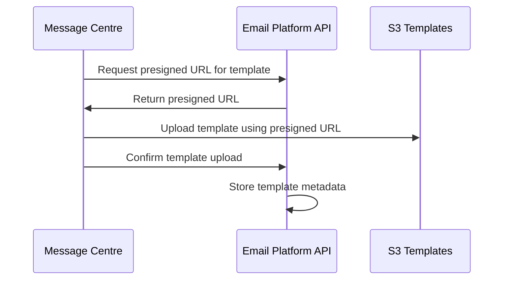
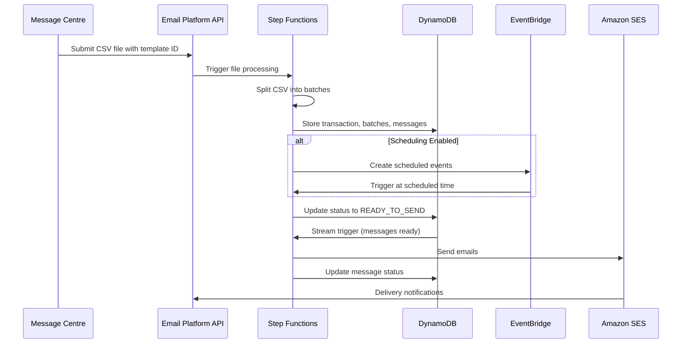
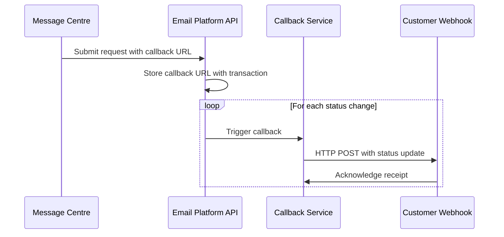

# Email Platform - Standalone Architecture Documentation

## Executive Summary

The Email Platform has been redesigned as a standalone service with clear separation from Message Centre. This architecture provides better scalability, maintainability, and allows for independent deployment and scaling of email functionality.

## Key Architectural Decisions

### 1. Standalone Email API Architecture
- **Email Platform**: Independent service with its own APIs, storage, and processing
- **Message Centre**: Acts as a wrapper/orchestrator that integrates with Email Platform APIs
- **Benefits**: Clear separation of concerns, independent scaling, better maintainability

### 2. File Upload Strategy
- **Templates**: Uploaded to Email Platform S3 via presigned URLs
- **CSV Files**: Recipient data uploaded via presigned URLs
- **Benefits**: Reduced API payload sizes, direct S3 upload, better performance

### 3. Hierarchical Data Structure
```
Transaction ID (Parent Level)
├── Batch ID (Split File Chunks)
    ├── Email Message ID (Individual Recipients)
    ├── Email Message ID (Individual Recipients)
    └── ...
```

### 4. Processing Pipeline
- **Step Functions**: Handle file splitting and conditional scheduling
- **EventBridge**: Manage scheduled email delivery
- **DynamoDB Streams**: Trigger email sending pipeline
- **Status Management**: Transaction-level and message-level status tracking

## Architecture Overview

### High-Level Components

1. **Message Centre Layer**
   - Web UI for user interaction
   - Wrapper APIs that integrate with Email Platform

2. **Email Platform Services**
   - Template Management API
   - Presigned URL Service
   - Email Processing API
   - Status Tracking API
   - Callback Service

3. **Processing Pipeline**
   - File Processing Step Functions
   - Scheduling Step Functions
   - Email Sending Step Functions

4. **Storage Layer**
   - S3 for templates and CSV files
   - DynamoDB for message data and status
   - OpenSearch for analytics and reporting

5. **Email Delivery**
   - Amazon SES for email delivery
   - SNS for SES event notifications

## Data Architecture

### DynamoDB Design

#### Transaction Table
```json
{
  "PK": "TRANSACTION#<transaction_id>",
  "SK": "METADATA",
  "transaction_id": "uuid",
  "status": "ACCEPT|PROCESSING|SCHEDULED|READY_TO_SEND|SENT|COMPLETED",
  "template_id": "uuid",
  "callback_url": "https://...",
  "total_messages": 1000,
  "created_at": "2024-01-01T00:00:00Z",
  "updated_at": "2024-01-01T00:00:00Z"
}
```

#### Batch Table
```json
{
  "PK": "TRANSACTION#<transaction_id>",
  "SK": "BATCH#<batch_id>",
  "batch_id": "uuid",
  "transaction_id": "uuid",
  "status": "PROCESSING|READY|SENT|COMPLETED",
  "message_count": 100,
  "s3_file_path": "s3://bucket/batch-file.csv"
}
```

#### Message Table
```json
{
  "PK": "BATCH#<batch_id>",
  "SK": "MESSAGE#<message_id>",
  "message_id": "uuid",
  "batch_id": "uuid",
  "transaction_id": "uuid",
  "recipient_email": "user@example.com",
  "placeholder_data": {"name": "John", "company": "ACME"},
  "status": "CREATED|SCHEDULED|READY_TO_SEND|SENDING|SENT|DELIVERED|BOUNCED|COMPLAINED|OPENED|CLICKED",
  "scheduled_time": "2024-01-01T10:00:00Z",
  "sent_time": "2024-01-01T10:05:00Z",
  "delivered_time": "2024-01-01T10:06:00Z"
}
```

### Status Management

#### Transaction-Level Statuses
1. **ACCEPT**: Transaction created in Email API
2. **PROCESSING**: Messages being loaded into DynamoDB
3. **SCHEDULED**: All messages scheduled (if scheduling enabled)
4. **READY_TO_SEND**: Ready for delivery
5. **SENT**: All messages sent to SES
6. **COMPLETED**: All messages delivered/bounced

#### Message-Level Statuses
1. **CREATED**: Message record created
2. **SCHEDULED**: Message scheduled for future delivery
3. **READY_TO_SEND**: Ready for processing
4. **SENDING**: Being processed by SES
5. **SENT**: Sent to SES
6. **DELIVERED**: Successfully delivered
7. **BOUNCED**: Delivery failed
8. **COMPLAINED**: Spam complaint received
9. **OPENED**: Email opened by recipient
10. **CLICKED**: Link clicked in email

## Processing Flows

### 1. Template Upload Flow


### 2. Email Campaign Processing Flow


### 3. Callback Flow


## Security Architecture

### Authentication & Authorization
1. **API Key (Mandatory)**: All requests must include valid API key
2. **OAuth 2.0 (Optional)**: For enhanced security and user context
3. **mTLS (Optional)**: For high-security environments

### Security Controls
- **AWS WAF**: Protection against common web attacks
- **API Gateway**: Rate limiting and request validation
- **IAM Roles**: Service-to-service authentication
- **Secrets Manager**: Secure storage of API keys and secrets
- **KMS**: Encryption key management

### Data Protection
- **Encryption at Rest**: All data encrypted in S3, DynamoDB, and OpenSearch
- **Encryption in Transit**: TLS 1.2+ for all communications
- **Data Isolation**: Multi-tenant data separation
- **Access Logging**: Comprehensive audit trails

## Integration Patterns

### API Integration
```http
POST /api/v1/email/campaigns
Authorization: Bearer <oauth_token>
X-API-Key: <api_key>
Content-Type: application/json

{
  "template_id": "uuid",
  "csv_file_url": "s3://bucket/recipients.csv",
  "callback_url": "https://customer.com/webhook",
  "schedule": {
    "send_at": "2024-01-01T10:00:00Z"
  }
}
```

### Webhook Callbacks
```http
POST https://customer.com/webhook
Content-Type: application/json
X-Signature: <hmac_signature>

{
  "transaction_id": "uuid",
  "status": "COMPLETED",
  "timestamp": "2024-01-01T10:30:00Z",
  "summary": {
    "total_messages": 1000,
    "delivered": 950,
    "bounced": 30,
    "complained": 5,
    "opened": 400,
    "clicked": 120
  }
}
```

## Analytics & Reporting

### OpenSearch Data Structure
```json
{
  "transaction_id": "uuid",
  "message_id": "uuid",
  "event_type": "delivered|bounced|complained|opened|clicked",
  "timestamp": "2024-01-01T10:06:00Z",
  "recipient_email": "user@example.com",
  "metadata": {
    "user_agent": "...",
    "ip_address": "...",
    "link_url": "..."
  }
}
```

### Analytics Capabilities
- Real-time delivery tracking
- Engagement analytics (opens, clicks)
- Bounce and complaint analysis
- Performance metrics and trends
- Custom reporting and dashboards

## Scalability & Performance

### Horizontal Scaling
- **Lambda Functions**: Auto-scaling based on demand
- **Step Functions**: Parallel processing of batches
- **DynamoDB**: On-demand scaling
- **SES**: Built-in scalability

### Performance Optimizations
- **Batch Processing**: Efficient file splitting and processing
- **Parallel Execution**: Concurrent email sending
- **Caching**: Template and configuration caching
- **Connection Pooling**: Optimized database connections

## Monitoring & Observability

### CloudWatch Metrics
- API request rates and latency
- Processing pipeline performance
- Email delivery rates
- Error rates and types

### X-Ray Tracing
- End-to-end request tracing
- Performance bottleneck identification
- Service dependency mapping

### Alerting
- Failed email deliveries
- High bounce rates
- API error rates
- Processing delays

## Cost Optimization

### Cost Factors
- **Lambda**: Pay per execution
- **Step Functions**: Pay per state transition
- **DynamoDB**: On-demand pricing
- **S3**: Storage and transfer costs
- **SES**: Pay per email sent

### Optimization Strategies
- Efficient batch sizing
- Optimal Lambda memory allocation
- DynamoDB capacity planning
- S3 lifecycle policies
- SES reputation management

## Implementation Phases

### Phase 1: Core Platform (Q1 2024)
- Standalone Email API development
- Basic file processing pipeline
- Template management
- Status tracking

### Phase 2: Advanced Features (Q2 2024)
- Scheduling capabilities
- Callback system
- Enhanced analytics
- Security hardening

### Phase 3: Enterprise Features (Q3 2024)
- Advanced reporting
- Multi-region deployment
- Enhanced monitoring
- Performance optimization

### Phase 4: AI & Optimization (Q4 2024)
- AI-powered optimization
- Predictive analytics
- Advanced personalization
- Machine learning insights

## Compliance & Governance

### Email Compliance
- **CAN-SPAM Act**: Compliance with US regulations
- **GDPR**: European data protection compliance
- **CCPA**: California privacy compliance
- **Australian Spam Act**: Australian regulations

### Data Governance
- Data retention policies
- Privacy controls
- Audit logging
- Compliance reporting

## Disaster Recovery

### Backup Strategy
- **DynamoDB**: Point-in-time recovery enabled
- **S3**: Cross-region replication
- **Configuration**: Infrastructure as Code

### Recovery Procedures
- **RTO**: 4 hours for full service restoration
- **RPO**: 15 minutes maximum data loss
- **Failover**: Automated failover to secondary region

---

**Document Version**: 2.0  
**Last Updated**: August 17, 2024  
**Next Review**: September 17, 2024
